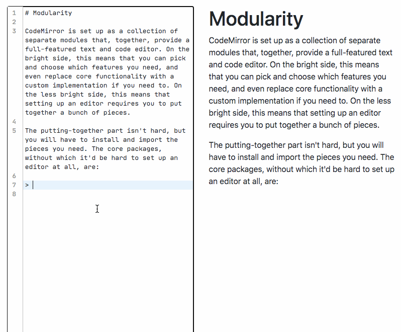

# SSVM-backed Markdown editor demo

A [second state](https://www.secondstate.io/articles/raspberry-pi-for-free-20200709/) practice project.

## Development

### VSCode Remote Container (recommended)

1. Clone this project and open with VSCode
2. Install Remote Container extension and restart the project in container, waiting the container finish setting up.
3. `ssvmup build` in docker terminal
4. `cd node`, `npm install` and start server by `node node/app.js`
5. Start frontend development build with `npm run dev`

## Tooling

- SSVM
- comrak
- koajs

